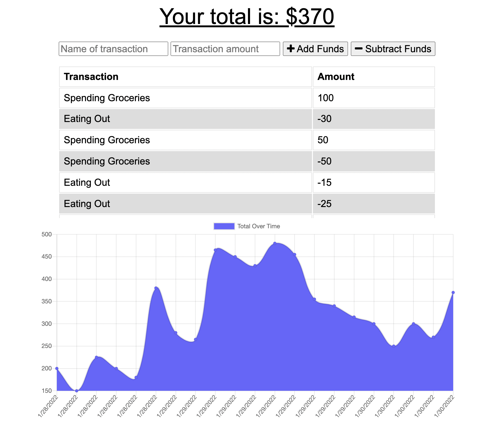
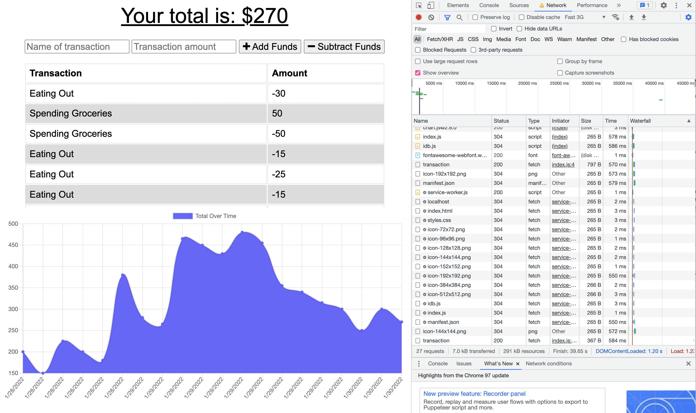
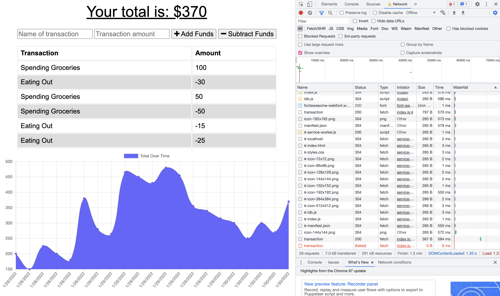
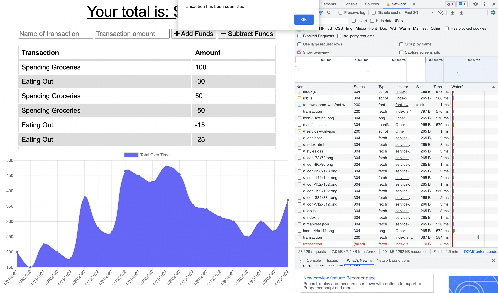

# Budget-Tracker Offline

This is a budget tracker application that allows for offline access and functionality. Users are able to add their expenses and deposits to their budget with or without a internet connection. Their offline transactions will be updated when brought back from offline.

## Description

On this application, users are able to track their deposits and withdrawls from this budget with or without a internet or data connection. 

Without an internet connection, users are able to input a deposit or withdrawal of their money. Once the user is returned to an stable internet connection, the deposit or withdrawl they made offline will be added to their transaction history and their total will be updated, proven by a notification from the broswer.

## Table of Contents
- [Description](#Description)
- [Installation](#Installation)
- [Usage](#Usage)
- [Developed With](#Developed-with)

## Installation
- While this application is online and deployed from Heroku, this file can be cloned through GitHub using the above Code button.
- The following npm packages listed in the `Developed With` tab are required to be installed in order to test the application. Use `npm i` in the Terminal to install them and `npm start` to run the test server of the website.

## Usage

- The URL of the functional, deployed application. 
https://ancient-coast-11043.herokuapp.com/

- The URL of the GitHub repository, with a unique name and a README describing the project.
https://github.com/trujilml/budget-tracker-offline

## Developed With

- Progressive Web Application (PWA) - an application software that is delivered through the web, using service workers, manifest files, and other enhancement techniques used to give users a great experience on the application.
- Compression - Data compression middleware. - https://github.com/expressjs/compression
- Express.js - Web framework connected with MongoDB and Mongoose, functions transaction routes for the API. - https://expressjs.com/ 
- IndexedDB - A low-level API application for client-side storage of structured data, used to trigger the transaction event for the application.
- MongoDB - A NoSQL database that is an open-source document database allowing data to be formatted easier than a regular SQL database. - https://www.mongodb.com/
- Mongoose - Schema based solution to model application data, acts as a front-end to MongoDB. - https://mongoosejs.com/
- Morgan - HTTP request logger middleware for node.js - https://www.npmjs.com/package/morgan
- MongoDB Atlas - Multi-cloud database server that is used to deploy this application with its respective MongoDB database - https://www.mongodb.com/atlas/database
- Heroku - Cloud platform used to deploy this application in a web link from its respective CLI.
- Node.js - Back-end development software, JavaScript runtime environment that runs these npm package applications.
- JavaScript - Back-end development code